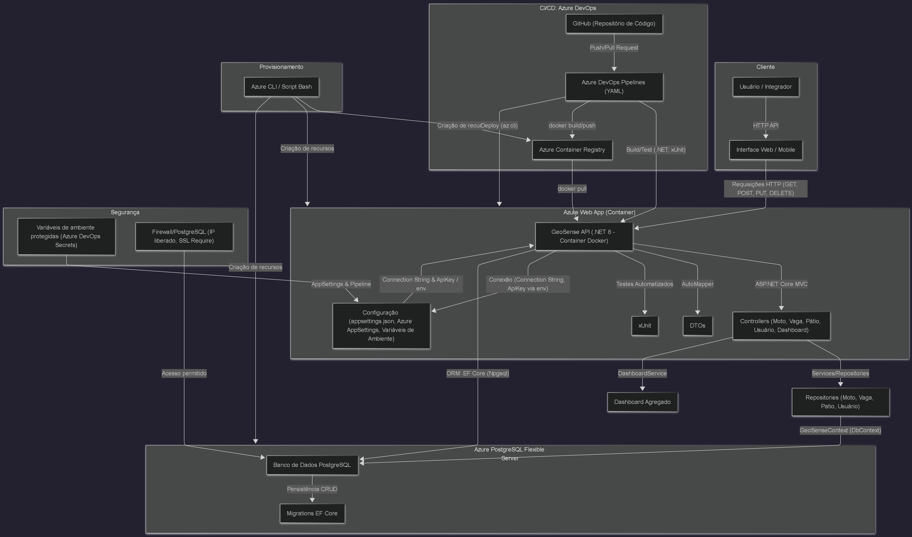

# GeoSense API - DevOps Tools & Cloud Computing 🚀

## 👤 Integrantes

- **Enzo Giuseppe Marsola** – RM: 556310, Turma: 2TDSPK  
- **Rafael de Souza Pinto** – RM: 555130, Turma: 2TDSPY  
- **Luiz Paulo F. Fernandes** – RM: 555497, Turma: 2TDSPF

---

## 💡 Descrição da Solução

GeoSense API é uma aplicação RESTful em .NET para gerenciamento de motos, vagas, pátios e usuários em ambientes de manutenção ou estacionamento. Permite operações completas de cadastro, consulta, atualização e remoção (CRUD) sobre as principais entidades do sistema, com integração total ao banco de dados na nuvem (Azure SQL) e publicação via App Service na Azure.

---

## 💼 Benefícios para o Negócio

A GeoSense API resolve problemas de controle e rastreabilidade de ativos em pátios e oficinas, oferecendo:
- Gestão centralizada e confiável de motos, vagas e usuários.
- Redução de erros e retrabalho, dados sempre disponíveis.
- Facilidade para consulta, alocação e monitoramento de status em tempo real.
- Otimização operacional e tomada de decisão por dados agregados (dashboard).

---

## 🗄️ Banco de Dados em Nuvem

- **Tecnologia:** Azure SQL Database (PaaS)
- **Criação automática via Azure CLI**
- **Script DDL:** [`scripts/script_bd.sql`](scripts/script_bd.sql)

---

## 🛠️ Conteúdo do Repositório

Este repositório contém:
- [Código-fonte da API (.NET)](GeoSense.API)
- [Testes automatizados (`GeoSense.API.Tests`)](GeoSense.API.Tests)
- [Scripts de banco (`script_bd.sql`)](scripts/script_bd.sql)
- [Scripts de deploy na Azure (`deploy_commands.txt`)](scripts/deploy_commands.txt)
- [Arquivos de configuração (`appsettings.json`)](GeoSense.API/appsettings.json)
- [Desenho de arquitetura da solução](arquitetura/desenho-arquitetura.png)

---

## ⚙️ Passo a Passo para Deploy e Testes

### Requisitos

- Azure CLI instalado e autenticado (`az login`)
- .NET SDK 8.0+
- Permissão para criar recursos na Azure

### 1. Clone o repositório

```bash
git clone https://github.com/MarsoL4/geosense-api-cloud.git
cd geosense-api-cloud
```

### 2. Crie os recursos na Azure via CLI (passo a passo)

1. **Crie o grupo de recursos Azure**  
   Este comando cria um agrupador para todos os recursos do projeto.
   ```bash
   az group create --name geosense-rg --location brazilSouth
   ```

2. **Crie o servidor SQL**  
   Cria o servidor do banco de dados SQL na Azure, onde o banco será hospedado.
   ```bash
   az sql server create --name geosensesqlserver --resource-group geosense-rg --location brazilSouth --admin-user geosenseadmin --admin-password "Geosense#2025"
   ```

3. **Crie o banco de dados SQL**  
   Cria o banco de dados dentro do servidor SQL criado no passo anterior.
   ```bash
   az sql db create --resource-group geosense-rg --server geosensesqlserver --name geosense-db --service-objective S0
   ```

4. **Obtenha a string de conexão do banco**  
   Exibe a string de conexão necessária para configurar a aplicação.
   ```bash
   az sql db show-connection-string --server geosensesqlserver --name geosense-db --client ado.net
   ```
   > **Atenção:** Na string recebida, será necessário adicionar o usuário (`User ID`) e senha (`Password`) do banco de dados nos espaços indicados.

5. **Libere acesso do App Service ao SQL**  
   Permite que serviços da Azure conectem-se ao banco de dados.
   ```bash
   az sql server firewall-rule create --resource-group geosense-rg --server geosensesqlserver --name AllowAzureServices --start-ip-address 0.0.0.0 --end-ip-address 0.0.0.0
   ```

6. **Libere acesso do seu IP ao SQL**  
   Permite que você acesse o banco de dados diretamente pelo seu IP.
   ```bash
   az sql server firewall-rule create --resource-group geosense-rg --server geosensesqlserver --name AllowLocal --start-ip-address <SEU_IP> --end-ip-address <SEU_IP>
   ```
   > Substitua `<SEU_IP>` pelo seu IP real.

7. **Crie o plano do App Service**  
   Cria o plano de hospedagem para o serviço de aplicação.
   ```bash
   az appservice plan create --name geosense-plan --resource-group geosense-rg --location brazilSouth --sku B1
   ```

8. **Crie o App Service (.NET 8)**  
   Cria o serviço de aplicação onde a API será publicada.
   ```bash
   az webapp create --resource-group geosense-rg --plan geosense-plan --name geosense-app --runtime "dotnet:8"
   ```

9. **Configure a string de conexão no App Service**  
   Adiciona a string de conexão do banco (com usuário e senha) nas configurações do App Service.
   ```bash
   az webapp config connection-string set --resource-group geosense-rg --name geosense-app --connection-string-type SQLAzure --settings DefaultConnection="<String_Recebida>"
   ```

10. **Compile e publique o projeto**  
    Compila o projeto para pasta de publicação.
    ```bash
    dotnet publish -c Release -o ./publish
    ```

11. **Compacte os arquivos publicados**  
    Gera um arquivo ZIP para envio ao App Service.
    ```bash
    Compress-Archive -Path ./publish/* -DestinationPath ./app.zip
    ```

12. **Faça o deploy do ZIP para o App Service**  
    Publica a API na Azure.
    ```bash
    az webapp deployment source config-zip --resource-group geosense-rg --name geosense-app --src ./app.zip
    ```

### 3. Acesse o Swagger da API publicada

```
https://geosense-app.azurewebsites.net/swagger
```
- Teste todos os endpoints CRUD conforme exemplos abaixo.

### 4. Script DDL do Banco

- Estrutura completa das tabelas e índices em [`scripts/script_bd.sql`](scripts/script_bd.sql)

---

## 📦 Exemplos de Uso (JSON para testes)

### Moto (CRUD)
```json
POST /api/moto
{
  "modelo": "Honda CG 160",
  "placa": "ABC1D23",
  "chassi": "9C2JC4110JR000001",
  "problemaIdentificado": "Motor com ruído excessivo",
  "vagaId": 1
}
```

### Vaga (CRUD)
```json
POST /api/vaga
{
  "numero": 101,
  "tipo": 0,
  "status": 0,
  "patioId": 1
}
```

### Usuário (CRUD)
```json
POST /api/usuario
{
  "nome": "Rafael de Souza Pinto",
  "email": "rafael.pinto@exemplo.com",
  "senha": "12345678",
  "tipo": 0
}
```

### Pátio (CRUD)
```json
POST /api/patio
{
  "nome": "Pátio Central"
}
```

### Dashboard (GET)
Resposta esperada:
```json
GET /api/dashboard
{
  "totalMotos": 10,
  "motosComProblema": 2,
  "vagasLivres": 8,
  "vagasOcupadas": 2,
  "totalVagas": 10
}
```

---

## 🎬 Link do Vídeo

- **Vídeo Demonstrativo:** [https://youtu.be/BskTdAPH5dg](https://youtu.be/BskTdAPH5dg)

---

## 🏗️ Arquitetura da Solução

Abaixo está o desenho da arquitetura da solução, detalhando todos os recursos, fluxos e funcionamento após o deploy:



- **Recursos:** App Service (.NET), Azure SQL Database, configuração via Azure CLI
- **Fluxo:** Usuário → API (.NET) → Banco de Dados na Nuvem → Retorno dos dados (CRUD, dashboard, etc)
- **Explicação:** 
  1. Usuário acessa a API via Swagger ou HTTP.
  2. Realiza operações CRUD sobre motos, vagas, pátios e usuários.
  3. Dados trafegam pela API .NET hospedada no App Service.
  4. Persistência e consultas ocorrem diretamente no Azure SQL Database.
  5. Resultados apresentados em tempo real, inclusive dashboard agregado.

---

## 🧪 Testes Automatizados

Para rodar todos os testes unitários:
```bash
cd GeoSense.API.Tests
dotnet test
```
