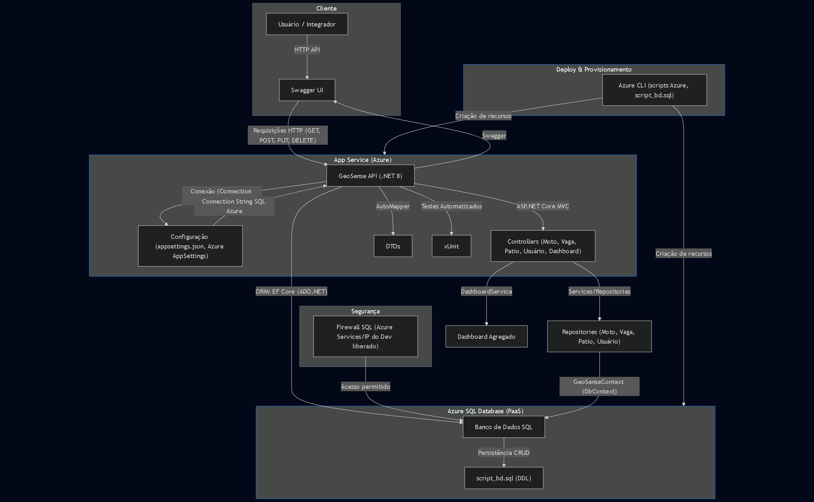

# GeoSense API - DevOps Tools & Cloud Computing

## 👥 Integrantes

- **Enzo Giuseppe Marsola** – RM: 556310, Turma: 2TDSPK  
- **Rafael de Souza Pinto** – RM: 555130, Turma: 2TDSPY  
- **Luiz Paulo F. Fernandes** – RM: 555497, Turma: 2TDSPF

---

## 1️⃣ Descrição da Solução

GeoSense API é uma aplicação RESTful em .NET para gerenciamento de motos, vagas, pátios e usuários em ambientes de manutenção ou estacionamento. Permite operações completas de cadastro, consulta, atualização e remoção (CRUD) sobre as principais entidades do sistema, com integração total ao banco de dados na nuvem (Azure SQL) e publicação via App Service na Azure.

---

## 2️⃣ Benefícios para o Negócio

A GeoSense API resolve problemas de controle e rastreabilidade de ativos em pátios e oficinas, oferecendo:
- Gestão centralizada e confiável de motos, vagas e usuários.
- Redução de erros e retrabalho, dados sempre disponíveis.
- Facilidade para consulta, alocação e monitoramento de status em tempo real.
- Otimização operacional e tomada de decisão por dados agregados (dashboard).

---

## 3️⃣ Banco de Dados em Nuvem

- **Tecnologia:** Azure SQL Database (PaaS)
- **Criação automática via Azure CLI**
- **Script DDL:** [`scripts/script_bd.sql`](scripts/script_bd.sql)
- **Não utiliza H2 ou Oracle da FIAP, conforme requisitos.**

---

## 4️⃣ CRUD Completo

A API implementa CRUD completo para as entidades principais (Moto, Vaga, Patio, Usuário) com todos os métodos acessíveis via Swagger.

---

## 5️⃣ Manipulação de Registros Reais

Durante a demonstração, são manipulados pelo menos 2 registros reais em cada tabela via API, diretamente no banco de dados em nuvem.

---

## 6️⃣ Código-fonte e Scripts no GitHub

Este repositório contém:
- Código-fonte da API (.NET)
- Testes automatizados (`GeoSense.API.Tests`)
- Scripts de banco (`scripts/script_bd.sql`)
- Scripts de deploy na Azure (`scripts/deploy_commands.txt`)
- Arquivos de configuração (`appsettings.json`)
- Desenho de arquitetura da solução: ([Imagem no Repositório](arquitetura/desenho-arquitetura.png))

---

## 7️⃣ Passo a Passo para Deploy e Testes

### ⚡ Requisitos

- Azure CLI instalado e autenticado (`az login`)
- .NET SDK 8.0+
- Permissão para criar recursos na Azure

### 🚀 Deploy na Azure (App Service + SQL Database via CLI)

1. **Clone o repositório**
   ```bash
   git clone https://github.com/MarsoL4/geosense-api-cloud.git
   cd geosense-api-cloud
   ```

2. **Siga os comandos do script de deploy**
   - Todos os comandos necessários estão em [`scripts/deploy_commands.txt`](scripts/deploy_commands.txt)
   - Execute cada comando na ordem apresentada para criar grupo de recursos, banco, App Service, configurar firewall e publicar a aplicação.

3. **Configure a string de conexão**
   - Siga as instruções do script para obter e ajustar a string de conexão do banco no App Service.

4. **Acesse o Swagger da API publicada**
   ```
   https://geosense-app.azurewebsites.net/swagger
   ```
   - Teste todos os endpoints CRUD conforme exemplos abaixo.

### 📄 Scripts Azure CLI

- Todos os scripts de criação/configuração de recursos estão em [`scripts/deploy_commands.txt`](scripts/deploy_commands.txt)

### 🗄️ Script DDL do Banco

- Estrutura completa das tabelas e índices em [`scripts/script_bd.sql`](scripts/script_bd.sql)

---

## 8️⃣ Exemplos de Uso (JSON para testes)

### Moto (CRUD)
```json
POST /api/moto
{
  "modelo": "Honda CG 160",
  "placa": "ABC1D23",
  "chassi": "9C2JC4110JR000001",
  "problemaIdentificado": "Motor com ruído excessivo",
  "vagaId": 1
}
```

### Vaga (CRUD)
```json
POST /api/vaga
{
  "numero": 101,
  "tipo": 0,
  "status": 0,
  "patioId": 1
}
```

### Usuário (CRUD)
```json
POST /api/usuario
{
  "nome": "Rafael de Souza Pinto",
  "email": "rafael.pinto@exemplo.com",
  "senha": "12345678",
  "tipo": 0
}
```

---

## 🔗 Link do Vídeo

- **Vídeo Demonstrativo:** [https://youtu.be/BskTdAPH5dg](https://youtu.be/BskTdAPH5dg)

---

## 🏗️ Arquitetura da Solução

Abaixo está o desenho da arquitetura da solução, detalhando todos os recursos, fluxos e funcionamento após o deploy:



- **Recursos:** App Service (.NET), Azure SQL Database, configuração via Azure CLI
- **Fluxo:** Usuário → API (.NET) → Banco de Dados na Nuvem → Retorno dos dados (CRUD, dashboard, etc)
- **Explicação:** 
  1. Usuário acessa a API via Swagger ou HTTP.
  2. Realiza operações CRUD sobre motos, vagas, pátios e usuários.
  3. Dados trafegam pela API .NET hospedada no App Service.
  4. Persistência e consultas ocorrem diretamente no Azure SQL Database.
  5. Resultados apresentados em tempo real, inclusive dashboard agregado.

---

## 🧪 Testes Automatizados

Para rodar todos os testes unitários:
```bash
cd GeoSense.API.Tests
dotnet test
```
